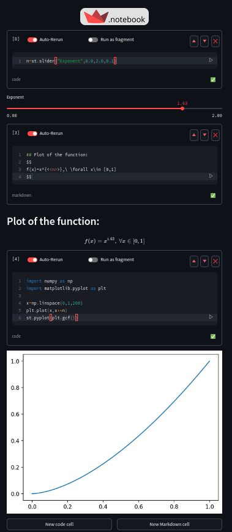
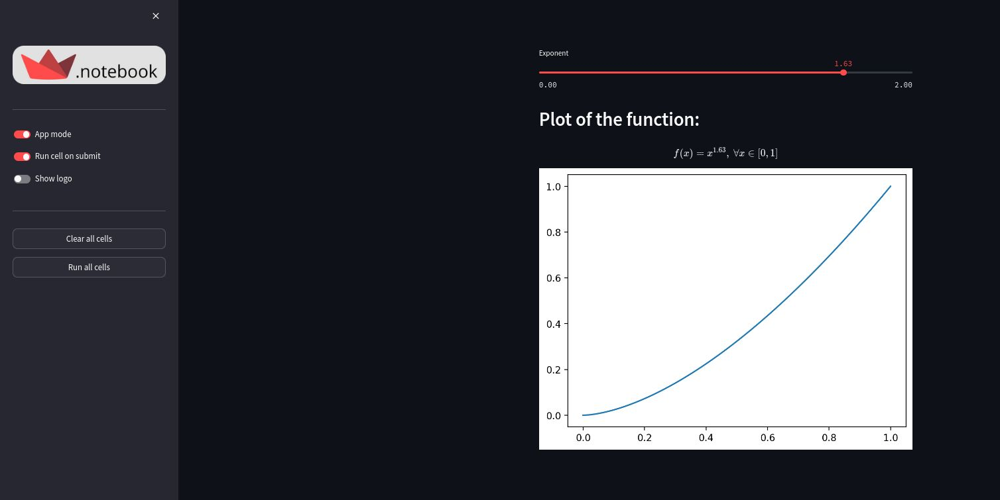

# Streamlit Notebook

`streamlit_notebook` is a reactive notebook interface for Streamlit.

Pretty much like a Jupyter notebook, you can create and run Code cells (supporting Streamlit commands) or Markdown/HTML cells. These cells will be executed dynamically and rendered under each cell box.

The main difference with a Jupyter notebook is that the notebook is reactive: Any UI event modifying the value of a variable gets immediately reflected in the python code and vice versa. 

The execution flow follows the same logic as a Streamlit script, where each cell gets re-executed in order each time the UI triggers an event. Most notably, the python session gets reinitialized every new loop and all variables/objects that have not been saved in st.session_state will be lost at the end of the current run, and redefined in the next which is somewhat different from what one would expect in a persistent Python session.

This notebook is meant to be fully compatible with Streamlit and doesn't introduce any specific logic beyond standard Streamlit functionning. All Streamlit commands should work out of the box. If it's not the case, it should be reported as a bug.

I hope users already familiar with Streamlit will have great fun with this notebook. 

## Features

- Switch to "App" mode by hiding code cells and notebook specific controls.
- Create and delete cells easily, move cells up and down, control how they execute.
- Create reactive Markdown or HTML cells by adding formatting tags `<<my_expression>>` that let you insert the current value of any global / state variable or evaluated expression into the text/code.
- Easily download / upload your notebooks as json files.
- The whole notebook UI can be controled dynamically from code cells. You can refer to the notebook object as `st.notebook` from within the session.

## Screenshot






## Installation

```bash
pip install streamlit-notebook
```

## Usage

You may open a new notebook from anywhere by just running `st_notebook` in the terminal.

You may as well create a python file like so :

```python 
# notebook.py
from streamlit_notebook import st_notebook

st_notebook()
```

and run it using `streamlit run notebook.py` from the terminal.

The `st_notebook()` function imported from the package is a complete app in itself rather than a single component, and only serves as an entry point.

The app is also available online [here](https://st-notebook.streamlit.app/)

## Contribution

This App is still in early stage of development and any feedbacks / contributions are welcome!

I think it has a lot of potential and would benefit greatly from community engagement.

In case you want to give feedback or report a bug / suggest an improvement. Please open an new issue.

If you wish to contribute to this project, please follow these instructions:

1. Fork the repository
2. Create a branch for your feature (`git checkout -b feature/AmazingFeature`)
3. Commit your changes (`git commit -m 'Add some AmazingFeature'`)
4. Push the branch (`git push origin feature/AmazingFeature`)
5. Open a Pull Request

## License

This project is licensed under the MIT License - see the [LICENSE](LICENSE) file for details.
