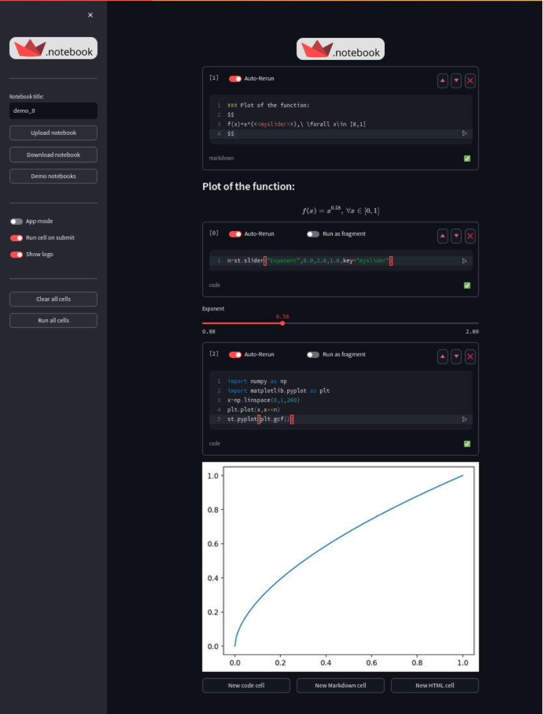
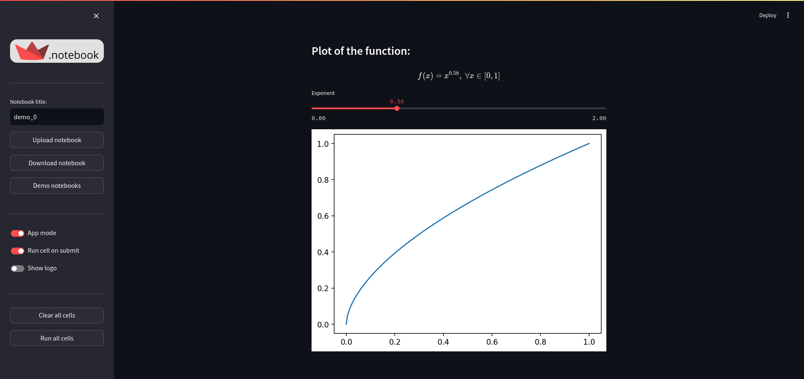

# Streamlit Notebook

`streamlit_notebook` is a reactive notebook interface for Streamlit.

Pretty much like a Jupyter notebook, you can create and run Code cells (supporting rich display via Streamlit commands) or Markdown/HTML cells. These cells will be executed dynamically and their output will be rendered under each cell box.

The main feature of this notebook is to bridge the gap between a persistent python interactive session and a Streamlit app, to achieve selective reactivity in your notebook. 

Simply put, you can switch between using one-shot cells to run code just once, and looping cells, that will rerun based on the occurence of ui events.

The cell's code is run in a custom shell with its own internal namespace, preserved across reruns. The results of computations are therefore automatically stored in it, just like a regular python console. The added possibility to make chosen cells auto-rerun (possibly as fragments) allows to use streamlit code seamlessly and manage UI reactivity with adequate control. 

This notebook is meant to be fully compatible with Streamlit and doesn't introduce much complexity beyond standard Streamlit functionning. All Streamlit commands should work out of the box. If it's not the case, it should be reported as a bug.

I hope users already familiar with Streamlit will have great fun with this notebook.

## Features

- Switch to "App" mode by hiding code cells and notebook specific controls.
- Create and delete cells easily, move cells up and down, control how they execute.
- Create reactive Markdown or HTML cells by adding formatting tags `<<my_expression>>` that let you insert the current value of any global / state variable or evaluated expression into the text/code.
- Special `display` function that you can use even in one-shot cells to display python data in a pretty manner to the frontend (uses `st.write` as a default backend). 
- Automatic evaluation and display of single expressions. Can be selectively deactivated using semicolons at the end of the expression or by switching the display mode in the sidebar menu.
- Easily download / upload your notebooks as `.stnb` files (json format).
- The whole notebook UI can be controled dynamically from code cells. This feature will be refined as I advance this project, but can already be played with. You can refer to the notebook object as `notebook` from within the session and call its methods programmaticaly. For instance you can programmatically create, edit and run cells:

```python
# Create a new cell and run it
cell=notebook.new_cell(code="print('Hello!')",type="code")
cell.run()
```

```python
# Edit and existing cell and run it
cell=notebook.cells[1]
cell.code="print('Hello world!')"
cell.run()
```


## Screenshot






## Installation

```bash
pip install streamlit-notebook
```

## Usage

Once installed, you may open the notebook interface from anywhere by just running `st_notebook` in the terminal.

Or pass a notebook file to open it directly:
```bash
$ st_notebook my_notebook.stnb
```

In case you need to use the package programmatically, you may create a python script like so: 

```python 
# notebook.py
from streamlit_notebook import st_notebook

st_notebook()
```

and run it using `streamlit run notebook.py` from the terminal.

The `st_notebook()` function accepts a local `stnb` file or a serialized notebook string as parameter.

This function is complete app in itself rather than a single component, and only serves as an entry point.

The app is meant to be run locally on your computer, the browser only being used as a GUI interface. Performance is better and allows to use your file system and packages in your sessions. It can be deployed to be used online and share your notebooks as apps, but keep in mind that in this case, the code will run remotely in the cloud server and you will be able to use only preinstalled packages. 

It is discouraged to introduce any sensitive data in your web sessions, as there is no inherent limitation on the code that can be run in the notebook (appart from limitations on the python packages that can be used). The app doesn't provide any additional security beyond those already implemented by Streamlit. A clever malvolent user could potentially reach your data or spy your session.

The app is available online [here](https://st-notebook.streamlit.app/) as a demo.

## Contribution

This App is still in early stage of development and any feedbacks / contributions are welcome!

I think it has a lot of potential and would benefit greatly from community engagement.

In case you want to give feedback or report a bug / suggest an improvement. Please open an new issue.

If you wish to contribute to this project, you're welcome to:

1. Fork the repository
2. Create a branch for your feature (`git checkout -b feature/AmazingFeature`)
3. Commit your changes (`git commit -m 'Add some AmazingFeature'`)
4. Push the branch (`git push origin feature/AmazingFeature`)
5. Open a Pull Request

## License

This project is licensed under the MIT License - see the [LICENSE](LICENSE) file for details.

## Changelog

- june 11th 2024:
    - Added HTML cells
    - Enabled uploading / downloading the notebook as a json file
    - Added a demo notebook (more to come)
    - Fixed st.echo that didn't work in an interactive environment 

- june 24th 2024:
    - Introduced the custom shell object and redirection utilities to integrate the shell smoothly in the notebook, making the session persistent across reruns.
    - Introduced ast parsing with asttokens library to evaluate and selectively display chosen expressions on the frontend, based on the presence of a trailing semicolon.
    - Added the `display` function, used for rich display of data in the notebook (using `st.write` as a backend).

- july 2nd 2024:
    - Improved dynamic cell creation, edition, and execution.
    - Added a couple demo notebooks to showcase these features.

- july 3rd 2024:
    - Notebook files now have a .stnb extension (content is still in json format).
    - Improved the st_notebook function to accept a .stnb file, or a serialized notebook string as parameter. Also improved the terminal command to accept a .stnb file as parameter. 